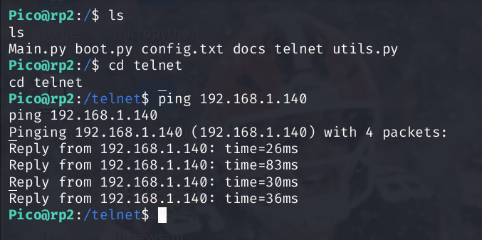

# PicoShell

**PicoShell** is a lightweight, real-time command-line interface (CLI) for the Raspberry Pi Pico W 2 (RP2350 dual-core), built entirely in MicroPython. It brings a minimal UNIX-style shell to embedded hardware with support for Wi-Fi networking, filesystem interaction, script execution, telnet access, and more.

---



## Features

- Basic shell command interface over USB or Telnet
- Wi-Fi networking with persistent config
- Telnet daemon that autostarts on successful network connection
- Filesystem tools: create, read, delete, navigate
- Script runner and file downloader
- System utilities: memory, clock speed, device info, and overclocking
- Built for expansion and real task threading with RP2350

---

## Commands

### General

| Command      | Description                          |
|--------------|--------------------------------------|
| `help`, `h`  | Show this help message               |
| `about`      | Show shell version & system info     |
| `clear`      | Clear the terminal display           |
| `exit`       | Exits back to MicroPython            |

### Filesystem

| Command        | Description                          |
|----------------|--------------------------------------|
| `pwd`          | Print current working directory      |
| `ls`           | List files and directories           |
| `cd <dir>`     | Change directory                     |
| `mkdir <dir>`  | Create a directory                   |
| `rmdir <dir>`  | Remove a directory                   |
| `rm <file>`    | Delete a file                        |
| `read <file>`  | Print contents of a file             |

### Networking

| Command              | Description                            |
|----------------------|----------------------------------------|
| `wifi`               | Connect to Wi-Fi using config file     |
| `ifconfig`           | Show IP and network info               |
| `ping <host>`        | Ping a host by IP or domain            |
| `curl <url>`         | Fetch and display content from URL     |
| `clone <url> [name]` | Download file from GitHub/raw URL      |
| `scan`               | Scan nearby Wi-Fi networks             |
| `pmap <host>`        | Nmap-style port scanner                |

### Telnet

| Command          | Description                            |
|------------------|----------------------------------------|
| `telnet launch`  | Start the telnet server                |
| `telnet stop`    | Stop the telnet server                 |

### Scripts

| Command          | Description                            |
|------------------|----------------------------------------|
| `run <file.py>`  | Execute a Python script from storage   |

### System

| Command           | Description                            |
|-------------------|----------------------------------------|
| `setclock <MHz>`  | Set CPU frequency (40–260 MHz)         |
| `clock`           | Show current CPU clock speed           |
| `dspace`          | Show available storage                 |
| `ram`             | Show current RAM usage                 |
| `sysinfo`         | Show detailed system/platform info     |

---

## Project Structure

```
boot.py             # Wi-Fi and Telnet auto-connect on boot
Main.py             # Main CLI loop
utils.py            # Core shell commands
utelnetserver.py    # Lightweight Telnet server
help.txt            # CLI help text
config.txt          # Wi-Fi credentials (SSID=..., PASSWORD=...)
```

---

## Getting Started

### 1. Flash MicroPython to Your Pico W 2

- Download the latest **MicroPython UF2 firmware** for the **Pico W 2 (RP2350)** from the [official MicroPython downloads page](https://micropython.org/download/rp2-pico-w/).
- Hold the **BOOTSEL** button while plugging in your Pico to your computer. It will appear as a USB drive.
- Drag and drop the downloaded `.uf2` file onto that drive.
- The Pico will reboot into MicroPython mode.

### 2. Upload PicoShell Files

- Upload the following to the root of the Pico filesystem:

  - `boot.py`
  - `Main.py`
  - `utils.py`
  - `telnet`
  - `docs`
  - `config.txt`

You can use any of the following tools:

#### Thonny IDE (GUI)

- Open [Thonny](https://thonny.org)
- Select "MicroPython (Raspberry Pi Pico)"
- Use the file browser to upload each file listed above

#### mpremote (CLI)

```bash
mpremote connect ttyUSB0 fs cp boot.py :
mpremote connect ttyUSB0 fs cp Main.py :
mpremote connect ttyUSB0 fs cp utils.py :
mpremote connect ttyUSB0 fs cp utelnetserver.py :
mpremote connect ttyUSB0 fs cp help.txt :
mpremote connect ttyUSB0 fs cp config.txt :
```

> Replace `ttyUSB0` with your actual serial port (e.g., `COM3` on Windows).

#### rshell / ampy

- Use `rshell` or `ampy` to push files to `/` on the board.

### 3. Configure Wi-Fi

Create a file called `config.txt` on the Pico containing:

```
SSID=YourNetwork
PASSWORD=YourPassword
```

- No spaces around the `=`
- No quotes
- Must be exact format

### 4. Run PicoShell

- Reset or power on the Pico W
- It will:
  - Connect to Wi-Fi using `config.txt`
  - Auto-start the telnet server
  - Drop into CLI via USB serial or Telnet if online

---

## License

MIT License — use it, modify it, ship it, just don’t pretend you made it.

---
